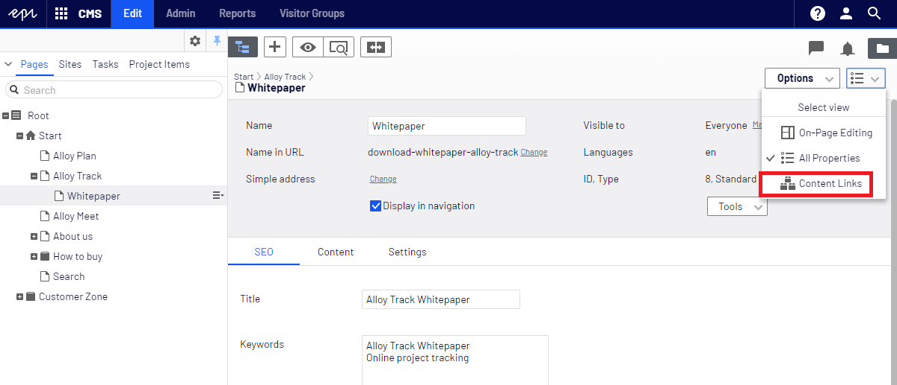
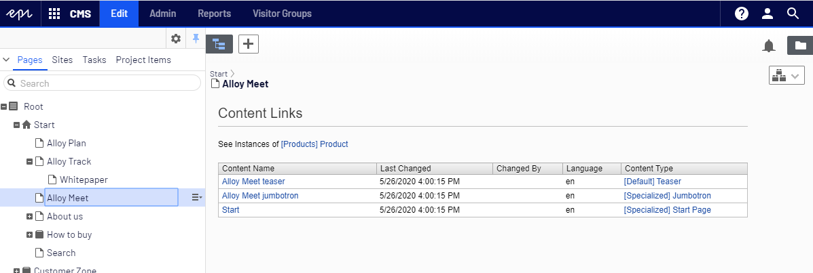

# Episerver.ContentUsages
This add-on creates an option within the editor where user can search for content that is referenced by the current item.

NuGet package:
```
Install-Package Verndale.ContentUsages
```


